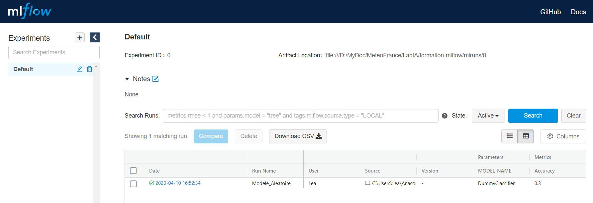

# Formation ML Flow
Vous trouverez ici une formation pour apprendre à utiliser **ML Flow**, un dashboard pour expériences de Machine Learning. Cette formation vous montrera pas à pas comment lancer une expérience de Machine Learning et surveiller les paramètres, métriques et resultats de l'expérience grâce à ML Flow. Pour cela, la formation s'appuiera sur le célèbre jeu de donnée Iris et sur un extrait de [MeteoNet](meteonet.umr-cnrm.fr).

## Qu’est ce que MLFLow ?
MLFlow est un outil graphique de monitoring d’expériences de Machine Learning, dans le même esprit que Tensorboard, qui permet facilement de surveiller et comparer vos expériences. Cet outil est simple d’utilisation : il vous permet en quelques lignes Python d’enregistrer tous les paramètres et métriques de vos expériences. De plus MLFlow ne dépend d’aucune librairie de Machine Learning, vous pourrez donc l’utiliser quelque soit votre librairie préférée (Tensorflow, PyTorch, Scikit-Learn,..).




## Pour quel public ?
Cette formation s’adresse aux personnes pratiquant le Machine Learning ou Deep Learning régulièrement.

## Prérequis

Commencez par cloner ce repertoire, ouvrez un terminal et naviguez jusqu'à la racine de ce dossier.

Plusieurs librairies Python étant nécessaires à cette formation, notamment MLFlow et scikit-learn, il vous faudra les installer. Les instructions d'installation sont disponibles [ici](installation.md).

## Déroulement de la formation

Une fois l'installation réalisée, lancez ```jupyter notebook``` et l'application Jupyter s'ouvrira alors automatiquement dans votre navigateur web. Vous pourrez ensuite ouvrir le notebook ```formation_MLFlow.ipynb``` et vous laisser guider par les instructions du notebook.

## Remerciements

Cette formation est inspirée du tutoriel ```Your First Machine Learning Project in Python Step-By-Step``` que vous pourrez retrouver [ici](https://machinelearningmastery.com/machine-learning-in-python-step-by-step/).

